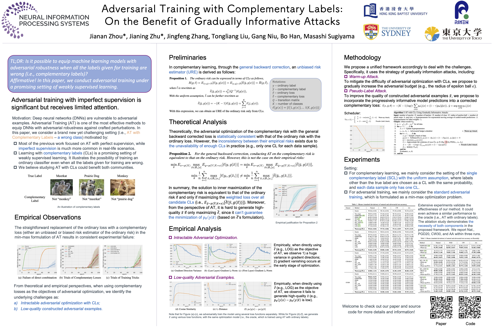
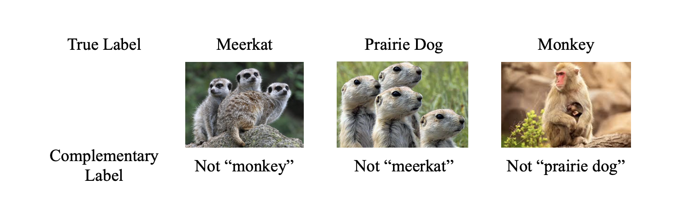

### Adversarial Training with Complementary Labels

[](https://openreview.net/forum?id=s7SukMH7ie9)&nbsp;&nbsp;&nbsp;&nbsp;[](https://openreview.net/pdf?id=s7SukMH7ie9)&nbsp;&nbsp;&nbsp;&nbsp;[](https://neurips.cc/virtual/2022/poster/55084)

Official (Pytorch) Implementation of *NeurIPS 2022 <font color='red'><b>Spotlight</b></font> "Adversarial Training with Complementary Labels: On the Benefit of Gradually Informative Attacks"* by [Jianan Zhou*](https://openreview.net/profile?id=~Jianan_Zhou1)*,* [Jianing Zhu*](https://openreview.net/profile?id=~Jianing_Zhu2)*,* [Jingfeng Zhang](https://openreview.net/profile?id=~Jingfeng_Zhang1)*,* [Tongliang Liu](https://openreview.net/profile?id=~Tongliang_Liu1)*,* [Gang Niu](https://openreview.net/profile?id=~Gang_Niu1)*,* [Bo Han](https://openreview.net/profile?id=~Bo_Han1)*,* [Masashi Sugiyama](https://openreview.net/profile?id=~Masashi_Sugiyama1).

```bash
@inproceedings{zhou2022adversarial,
title={Adversarial Training with Complementary Labels: On the Benefit of Gradually Informative Attacks},
author={Jianan Zhou and Jianing Zhu and Jingfeng Zhang and Tongliang Liu and Gang Niu and Bo Han and Masashi Sugiyama},
booktitle={Advances in Neural Information Processing Systems},
editor={Alice H. Oh and Alekh Agarwal and Danielle Belgrave and Kyunghyun Cho},
year={2022},
url={https://openreview.net/forum?id=s7SukMH7ie9}
}
```

<p align="center">
  
</p>

### TL;DR

> *How to equip machine learning models with adversarial robustness when all given labels in a dataset are wrong (i.e., complementary labels)?*

<p align="center">
  
</p>

### Dependencies

* Python 3.8
* Scipy
* [PyTorch 1.11.0](https://pytorch.org)
* [AutoAttack](https://github.com/fra31/auto-attack)

### How to Run

> Please refer to Section 5 and Appendix D.1 of our paper for the detailed setups.

#### Baseline

```bash
# Two-stage baseline for MNIST/Kuzushiji
python main.py --dataset 'kuzushiji' --model 'cnn' --method 'log' --framework 'two_stage' --cl_epochs 50 --adv_epochs 50 --cl_lr 0.001 --at_lr 0.01
# Two-stage baseline for CIFAR10/SVHN
python main.py --dataset 'cifar10' --model 'resnet18' --method 'log' --framework 'two_stage' --cl_epochs 50 --adv_epochs 70 --cl_lr 0.01 --at_lr 0.01

# Complementary baselines (e.g., LOG) for MNIST/Kuzushiji
python main.py --dataset 'kuzushiji' --model 'cnn' --method 'log' --framework 'one_stage' --adv_epochs 100 --at_lr 0.01 --scheduler 'none'
# Complementary baselines (e.g., LOG) for CIFAR10/SVHN
python main.py --dataset 'cifar10' --model 'resnet18' --method 'log' --framework 'one_stage' --adv_epochs 120 --at_lr 0.01 --scheduler 'none'
```

#### Ours

```bash
# MNIST/Kuzushiji
python main.py --dataset 'kuzushiji' --model 'cnn' --method 'log_ce' --framework 'one_stage' --adv_epochs 100 --at_lr 0.01 --scheduler 'cosine' --sch_epoch 50 --warmup_epoch 10
# CIFAR10/SVHN
python main.py --dataset 'cifar10' --model 'resnet18' --method 'log_ce' --framework 'one_stage' --adv_epochs 120 --at_lr 0.01 --scheduler 'cosine' --sch_epoch 40 --warmup_epoch 40
```

#### Options

```bash
# Supported Datasets (we cannot handle cifar100 on the SCL setting currently, i.e., complementary learning fails on CIFAR100 in our exp.)
--dataset - ['mnist', 'kuzushiji', 'fashion', 'cifar10', 'svhn', 'cifar100']
# Complementary Loss Functions
--method - ['free', 'nn', 'ga', 'pc', 'forward', 'scl_exp', 'scl_nl', 'mae', 'mse', 'ce', 'gce', 'phuber_ce', 'log', 'exp', 'l_uw', 'l_w', 'log_ce', 'exp_ce']
# Multiple Complementary Labels (MCLs)
--cl_num - (1-9) the number of complementary labels of each data; (0) MCLs data distribution of ICML2020 - "Learning with Multiple Complementary Labels"
```

### Reference

* [NeurIPS 2017] - [Learning from complementary labels](https://arxiv.org/abs/1705.07541)

* [ECCV 2018] - [Learning with biased complementary labels](https://arxiv.org/abs/1711.09535)

* [ICML 2019] - [Complementary-label learning for arbitrary losses and models](https://arxiv.org/abs/1810.04327)

* [ICML 2020] - [Unbiased Risk Estimators Can Mislead: A Case Study of Learning with Complementary Labels](https://arxiv.org/abs/2007.02235)

* [ICML 2020] - [Learning with Multiple Complementary Labels](https://arxiv.org/abs/1912.12927)

### Acknowledgments

Thank the authors of *"Complementary-label learning for arbitrary losses and models"* for the open-source [code](https://github.com/takashiishida/comp) and issue discussion. Other codebases may be found on the corresponding author's homepage. We also would like to thank anonymous reviewers of NeurIPS 2022 for their constructive comments.

### Contact

Please contact [jianan004@e.ntu.edu.sg](mailto:jianan004@e.ntu.edu.sg) and [csjnzhu@comp.hkbu.edu.hk](mailto:csjnzhu@comp.hkbu.edu.hk) if you have any questions regarding the paper or implementation.

