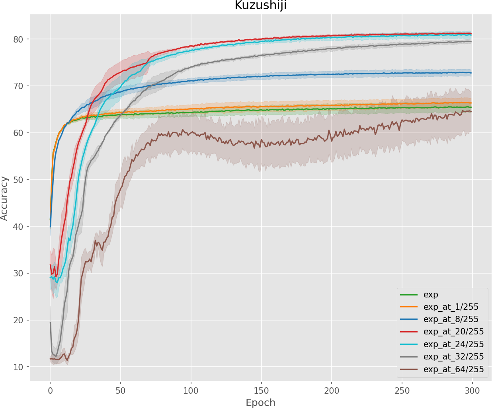

### Learning with Complementary Labels

#### Run
```shell
# EXP
CUDA_VISIBLE_DEVICES=0 nohup python -u main.py --dataset 'kuzushiji' --cl_num=1 --method 'exp' 2>&1 &
# EXP+AT
CUDA_VISIBLE_DEVICES=1 nohup python -u main.py --dataset 'kuzushiji' --cl_num=1 --method 'exp' --at 2>&1 &
```

#### Results

> Exp 1: 

|               |     s=1     |     s=2     |     s=3     |     s=4     |     s=5     |     s=6     |     s=7     |     s=8     |
| :-----------: | :---------: | :---------: | :---------: | :---------: | :---------: | :---------: | :---------: | :---------: |
|  ***MNIST***  |             |             |             |             |             |             |             |             |
|      EXP      |             |             |             |             |             |             |             |             |
|      LOG      |             |             |             |             |             |             |             |             |
|    EXP+AT     |             |             |             |             |             |             |             |             |
|    LOG+AT     |             |             |             |             |             |             |             |             |
| ***Fashion*** |             |             |             |             |             |             |             |             |
|      EXP      |             |             |             |             |             |             |             |             |
|      LOG      |             |             |             |             |             |             |             |             |
|    EXP+AT     |             |             |             |             |             |             |             |             |
|    LOG+AT     |             |             |             |             |             |             |             |             |
| **Kuzushiji** |             |             |             |             |             |             |             |             |
|      EXP      | 65.46(1.1)  | 70.61(0.22) | 72.13(0.56) | 78.95(2.57) | 80.8(2.62)  | 86.9(0.38)  | 86.42(2.64) | 89.57(0.1)  |
|      LOG      | 66.41(0.44) | 71.36(0.4)  | 76.95(2.06) | 82.04(2.96) | 86.15(0.48) | 88.12(0.42) | 89.35(0.11) | 90.28(0.09) |
|    EXP+AT     |             |             |             |             |             |             |             |             |
|    LOG+AT     |             |             |             |             |             |             |             |             |

> Ablation Study: num_steps=1, epsilon=step_size=$\theta$
>
> Note: Overfitting may exist when $\theta$ beyond 48/255.

<p align="center">  
  </br>
</p>

|            | MNIST  |        | Fashion |        |    Kuzushiji    |  3398  |
| :--------: | :----: | :----: | :-----: | :----: | :-------------: | :----: |
|            | EXP+AT | LOG+AT | EXP+AT  | LOG+AT |     EXP+AT      | LOG+AT |
|  Baseline  |        |        |         |        |   65.61(1.06)   |        |
| **1/255**  |        |        |         |        |   66.42(1.04)   |        |
|   2/255    |        |        |         |        |   67.52(1.0)    |        |
|   4/255    |        |        |         |        |   70.09(0.5)    |        |
|   6/255    |        |        |         |        |   71.83(0.66)   |        |
| **8/255**  |        |        |         |        |   72.84(0.73)   |        |
|   12/255   |        |        |         |        |   74.36(0.41)   |        |
|   16/255   |        |        |         |        |   76.96(2.93)   |        |
| **20/255** |        |        |         |        | **81.21(0.26)** |        |
| **24/255** |        |        |         |        |   80.91(0.79)   |        |
|   28/255   |        |        |         |        |   80.21(1.0)    |        |
| **32/255** |        |        |         |        |   79.47(0.42)   |        |
|   36/255   |        |        |         |        |   78.10(0.5)    |        |
|   40/255   |        |        |         |        |   76.32(0.13)   |        |
|   44/255   |        |        |         |        |   74.70(1.75)   |        |
|   48/255   |        |        |         |        |   62.58(7.92)   |        |
| **64/255** |        |        |         |        |   64.38(4.47)   |        |

#### Reference

1. Y. T. Chou, G. Niu, H. T. Lin, and M. Sugiyama.<br>**Unbiased Risk Estimators Can Mislead: A Case Study of Learning with Complementary Labels**.<br>In *ICML 2020*. [[paper]](https://arxiv.org/abs/2007.02235)
2. T. Ishida, G. Niu, A. K. Menon, and M. Sugiyama.<br>**Complementary-label learning for arbitrary losses and models**.<br>In *ICML 2019*. [[paper]](https://arxiv.org/abs/1810.04327)
3. Yu, X., Liu, T., Gong, M., and Tao, D.<br>**Learning with biased complementary labels**.<br>In *ECCV 2018*. [[paper]](https://arxiv.org/abs/1711.09535)
4. T. Ishida, G. Niu, W. Hu, and M. Sugiyama.<br>**Learning from complementary labels**.<br>In *NeurIPS 2017*. [[paper]](https://arxiv.org/abs/1705.07541)

